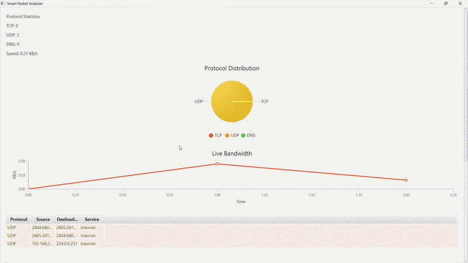
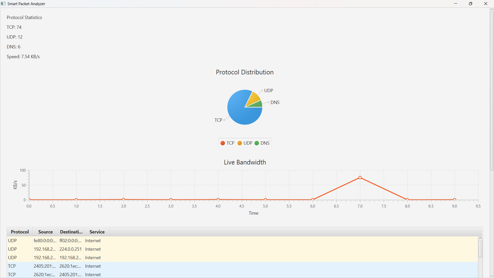

# 🚀 Smart Packet Analyzer

<p align="center">
  
</p>
<p align="center">
  <a href="https://github.com/Aditya-dxt/smart-packet-analyzer/releases/latest">
    
  </a>
</p>

<p align="center">
  
  
  
  
  
  
</p>

---

A real-time **Network Packet Analyzer Desktop Application** built using **Java, JavaFX, and Pcap4J** that captures live network traffic and visualizes protocol activity through interactive charts and dashboards.

Designed as a lightweight educational alternative to tools like **Wireshark**, focused on visualization and real-time analytics.

---

## 📸 Application Preview

<p align="center">
  
</p>

---

## ✨ Features

### 📡 Live Packet Capture
- Real-time packet sniffing
- TCP, UDP, and DNS monitoring
- Low-level inspection using **Pcap4J**
- Automatic active network interface detection

### 📊 Live Visualizations
- 📈 **Live Bandwidth Graph**
- 🥧 **Protocol Distribution Pie Chart**
- 🔢 Real-time protocol statistics
- Continuous UI updates without freezing

### 🌐 Website Detection
- Extracts domains from DNS packets
- Displays visited websites live
- Dynamic IP → Domain mapping

### 🎨 Smart JavaFX UI
- Responsive scrollable layout
- Color-coded protocol rows
- Start / Stop capture controls
- Thread-safe UI updates (Platform.runLater)

---

## 🏗️ Architecture


## ✨ Features

### 📡 Live Packet Capture
- Captures real-time network packets
- Supports TCP, UDP, and DNS monitoring
- Uses Pcap4J for low-level packet inspection

### 📊 Live Visualizations
- 📈 **Live Bandwidth Graph**
- 🥧 **Protocol Distribution Pie Chart**
- 🔢 Real-time protocol statistics

### 🌐 Website Detection
- Detects domains from DNS packets
- Displays visited websites live

### 🎨 Smart UI (JavaFX)
- Responsive scrollable layout
- Color-coded protocol rows
- Start / Stop capture controls
- Thread-safe UI updates

---

## 🏗️ Project Architecture

```
Packet Capture Engine (Main.java)
            ↓
     LiveDataBus (Event Layer)
            ↓
      JavaFX UI (App.java)
```

### Core Modules

| File | Responsibility |
|------|---------------|
| `Main.java` | Packet capture & analysis |
| `LiveDataBus.java` | Event communication |
| `App.java` | UI & charts |
| `PacketRow.java` | Table model |

---

## 🛠️ Tech Stack

- **Java 17**
- **JavaFX**
- **Pcap4J**
- **Maven**
- **Npcap / libpcap**

---

## ⚙️ Requirements

Before running:

- Install **Java 17+**
- Install **Maven**
- Install **Npcap** (Windows)

👉 Download Npcap: https://npcap.com/

Install with:
- ✅ WinPcap API Compatible Mode enabled

---

## ▶️ Run The Application

### Clone Repository

```bash
git clone https://github.com/Aditya-dxt/smart-packet-analyzer.git
cd smart-packet-analyzer
```

### Build Project

```bash
mvn clean install
```

### Run Application

```bash
mvn javafx:run
```

---

## 🖥️ Running from IDE

1. Open project in VS Code / IntelliJ
2. Ensure Maven dependencies are loaded
3. Run:

```
App.java → Run Main Method
```

---

## 📊 Current Capabilities

- ✅ Real-time packet capture
- ✅ Live bandwidth monitoring
- ✅ Protocol analytics
- ✅ DNS website detection
- ✅ Event-driven architecture
- ✅ JavaFX live charts

---

## 🚧 Future Improvements

- Multi-network interface selection
- Packet export (PCAP/CSV)
- Geo-IP visualization
- Traffic anomaly detection
- Dark mode UI

---

## 👨‍💻 Author

**Aditya Dixit**

GitHub: https://github.com/Aditya-dxt

---

## ⭐ Support

If you like this project:

- ⭐ Star the repo
- 🍴 Fork it
- 💡 Suggest improvements

---

## 📄 License

MIT License
